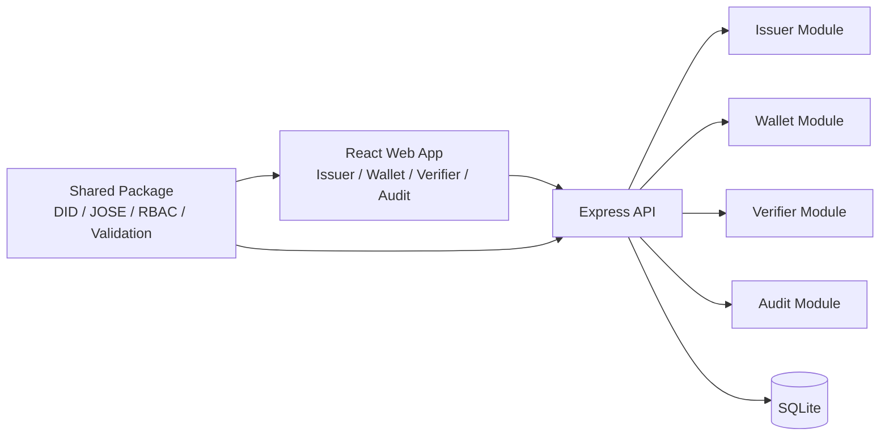

# DID-Based Admin Console Login + VC-Based RBAC MVP

Local portfolio MVP that replaces password-based admin login with DID/VC authentication and uses VC claims (`role`, `permissions[]`) for RBAC.

## Project Overview
- Single **React web app** with pages for **Issuer / Wallet / Verifier / Audit / Protected Consoles**
- Single **Express backend** with separated issuer, wallet, verifier, and audit modules
- Shared **TypeScript package** for DID/JOSE/RBAC/schema/validation logic
- **SQLite** for local persistence
- **did:jwk** as the default DID method
- **vc+jwt / vp+jwt** for low-friction local implementation

## Why DID/VC
This project demonstrates a security-oriented admin access model:
- no shared admin password
- signed credentials instead of static secrets
- explicit issuer trust validation
- replay-resistant authentication using nonce/state and VP JTI cache
- RBAC bound directly to credential claims
- credential suspension/revocation and auditable auth outcomes

## Architecture Summary
- **Frontend (`apps/web`)**: operator UI for issuer, wallet, verifier, and protected pages
- **Backend (`apps/api`)**: issues credentials, stores encrypted wallet material, validates VP submissions, issues sessions, writes audit logs
- **Shared (`packages/shared`)**: did:jwk, JOSE token signing/verification, role mapping, validation schemas/utilities
- **Database (`SQLite`)**: credentials, wallets, sessions, auth requests, replay cache, audit logs, keystore

## Authentication Flow
1. Verifier creates an OpenID4VP-style authorization request for `/admin`, `/audit`, or `/dev`.
2. Backend generates **cryptographically random nonce/state** and stores them as one-time auth request records.
3. Wallet selects a stored VC and creates a **VP JWT** bound to:
   - `aud = verifier client_id`
   - `nonce = auth request nonce`
4. Wallet submits the VP through **direct_post-style** backend handling.
5. Verifier validates:
   - issuer trust allowlist
   - VC and VP signatures
   - expiration / optional `nbf`
   - credential status (active / suspended / revoked)
   - audience binding
   - nonce binding
   - state match
   - holder binding
   - role/path mapping
   - replay via VP JTI cache
6. On success, backend issues an **HttpOnly session cookie** and stores a CSRF token server-side.

## RBAC
- `/admin` → **Admin** only
- `/audit` → **Auditor** only
- `/dev` → **Developer** only

When access is denied, the UI/API only exposes a summarized deny reason such as `insufficient role`, while detailed causes remain in audit logs.

## Replay Defense
- secure random `nonce` and `state` per auth request
- auth requests are marked **one-time use**
- VP `jti` stored in replay cache
- repeated submission of the same VP is rejected as `replay attempt`
- VP is bound to verifier `client_id` and `nonce`

## Revocation / Suspension
Credential rows are tracked in a local status registry:
- `active`
- `suspended`
- `revoked`

Verifier checks local status after VC cryptographic verification. The status check is intentionally abstractable so it can later be replaced by a standard status list mechanism.

## Security Limits and Extension Points
Current MVP choices are intentional for local simplicity:
- uses **did:jwk** instead of a network-resolved DID method
- uses local SQLite-backed trust and status data
- cookie security is configured for local HTTP demo use
- wallet storage uses passphrase-based local encryption, not device-bound secure enclave storage

Natural next steps:
- switch to HTTPS + secure cookies
- add DID resolver abstraction for `did:ethr`
- replace local status registry with Bitstring Status List
- use hardened key wrapping or HSM-backed issuer storage
- add richer CSRF/session rotation and admin hardening

## API Boundaries and Trust Boundary
- **Frontend is untrusted for verification decisions**. It only initiates requests and shows results.
- **Verifier module is the trust boundary** for VP validation and session issuance.
- **Issuer module** is trusted to sign credentials using the locally generated issuer key.
- **Wallet module** stores holder credentials encrypted at rest with passphrase-derived encryption.
- **SQLite** is the local persistence layer for auth state, replay cache, and audit evidence.

## Repository Tree
```text
did-vc-rbac-mvp/
├─ apps/
│  ├─ api/
│  │  ├─ src/
│  │  │  ├─ db/
│  │  │  ├─ middleware/
│  │  │  ├─ modules/
│  │  │  │  ├─ audit/
│  │  │  │  ├─ issuer/
│  │  │  │  ├─ verifier/
│  │  │  │  └─ wallet/
│  │  │  ├─ security/
│  │  │  └─ seed/
│  │  └─ tests/
│  └─ web/
│     └─ src/
│        ├─ components/
│        ├─ hooks/
│        ├─ lib/
│        └─ pages/
├─ docs/
│  ├─ architecture.md
│  └─ threat-model.md
├─ packages/
│  └─ shared/
│     └─ src/
└─ README.md
```

## Mermaid Architecture Diagram


## Local Run
```bash
cd C:\Sjw_dev\Coding\did-vc-rbac-mvp
copy .env.example .env
npm install
npm run seed
npm run dev
```

Endpoints:
- Web: <http://localhost:5173>
- API: <http://localhost:3001>

## Demo Sequence
1. Create a holder DID in **Wallet**.
2. Issue an **Admin** VC in **Issuer** and import it into Wallet.
3. Start verifier login for `/admin`.
4. Create VP from Wallet and submit it in Verifier.
5. Access `/admin` successfully.
6. Repeat with **Auditor** for `/audit` and **Developer** for `/dev`.
7. Revoke a credential in Issuer and confirm login failure.
8. Issue an expired credential and confirm login failure.
9. Try wrong-role access and confirm denial.
10. Re-submit the same VP and confirm replay detection.
11. Tamper with a VP/VC token and confirm validation failure.

## Commands
```bash
npm install
npm run seed
npm run dev
npm run build
npm test
npm --workspace @did-vc-rbac/api run test
npm --workspace @did-vc-rbac/shared run test
npm --workspace @did-vc-rbac/web run test
```

## Test Scope
### Unit tests
- token validation
- role mapping
- status check
- nonce/state validation

### Integration tests
- normal login success
- revoked credential blocked
- expired credential blocked
- wrong audience blocked
- replay blocked
- insufficient role blocked
- tampered token blocked

## Resume-Friendly Bullet Examples
1. Built a local TypeScript monorepo implementing DID-based admin authentication with VC-backed RBAC for privileged console access.
2. Implemented OpenID4VP-style `direct_post` login with one-time nonce/state validation and VP replay protection using JTI cache.
3. Designed verifier-side trust validation covering issuer allowlisting, signature verification, holder binding, audience binding, and credential status enforcement.
4. Added local credential revocation/suspension workflows and audit logging for both successful and failed authentication events.
5. Delivered a security portfolio MVP with React, Express, SQLite, and shared JOSE/DID utilities, optimized for single-developer local execution.
